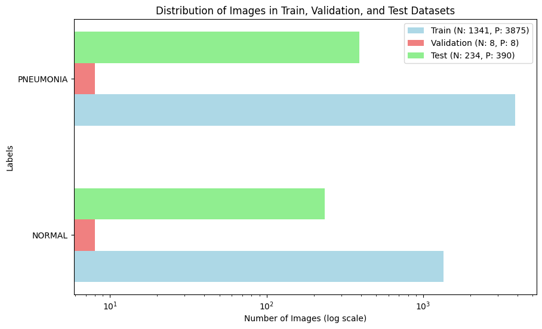
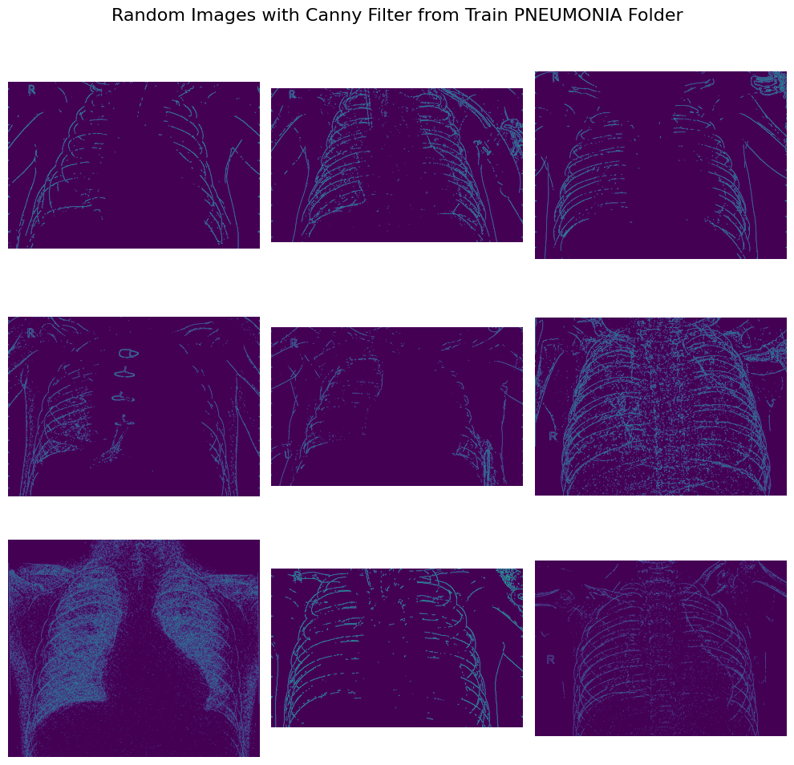
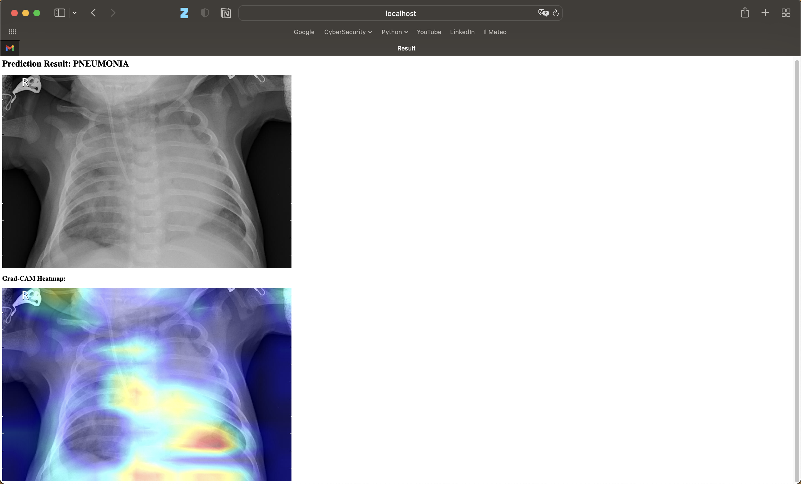

# Pneumonia_Detection

1. [Introduction](#introduction)
2. [Dataset](#dataset)
   * [Kaggle](#kaggle)
   * [Description](#description)
3. [Methods](#methods)
   * [Data Visualization](#data-visualization)
   * [Deep Learning models](#deep-learning-models)
       * [Model from scratch](#model-from-scratch)
       * [Transfer Learning](#transfer-learning)
   * [Grad-Cam](#grad-cam)
4. [Main Results](#main-results)
5. [Docker App](#docker-app)
6. [References](#references)

## Introduction

This project aims to study a public dataset on pneumonia detection based on a binary classification problem. I performed a data visualization phase, created a deep learning model from scratch, compared it with a transfer learning technique and completed this study with a grad cam integration. At the end of this case study, I created a docker app to upload a test function and receive prediction with heatmap from grad-cam.

According to World Health Organization (WHO)[[1](#ref1)], Pneumonia killed more than 808 000 children under the age of 5 in 2017, accounting for 15% of all deaths of children under 5 years. This not a disease only related to children, but it also includes adults over the age of 65 and people with preexisting health problems.

Pneumonia is a form of acute respiratory infection that is most commonly caused by viruses or bacteria.  When an individual has pneumonia, the alveoli are filled with pus and fluid, which makes breathing painful and limits oxygen intake. Timely and accurate diagnosis is crucial for effective treatment and management of pneumonia cases.

Some common methods [[2](#ref2)] used to diagnose pneumonia are:

- Blood tests, including a complete blood count (CBC) 
- Chest X-ray
- CT Scan
- Pulse Oximetry

## Dataset

### Kaggle

Dataset taken from: https://www.kaggle.com/datasets/paultimothymooney/chest-xray-pneumonia

It is composed by three main folders: train, test, val. Each of them contains two folders: NORMAL and PNEUMONIA. There are 5,863 X-Ray images (JPEG) and 2 categories (Pneumonia/Normal).

In [images](images/) there are just few examples to see the images I used. You can find the entire dataset at the Kaggle link.

### Description

Chest X-ray is one of the most commonly used imaging tests to diagnose pneumonia. They are widely available in medical facilities like clinics and hospitals, are generally more cost-effective and non-invasive for the patients. This kind of images can reveal the presence of infiltrates and other abnormalities in the lungs.

The dataset is distributed as shown in the following bar plot:

## Methods

### Data Visualization

In [data visualization notebook](data_visualization.ipynb), I used open cv, matplotlib, seaborn to visualize some useful information about the images and the dataset.

I've applied **Canny's Filter** as edge detector in order to enhance the visibility of edges in the images. It is an edge detection operator that uses a multi-stage algorithm to detect a wide range of edges in images. It was useful for detecting edges in noisy images and is particularly effective due to its ability to suppress noise while preserving important edge information. 

I've analyzed the distribution of widths and heights for images in each class (Pneumonia and Normal). Histogram analysis provides valuable insights so to verify no differences into the distribution of pixel intensities across images.

I've also compared pixel distribution for two representative images from the Pneumonia and Normal classes. This was necessary to see if there were some kind of discrepancies between the two classes.

### Deep Learning models

In [model deep learning notebook](model_deep_learning.ipynb), I wanted to create two different deep learning approaches to detect pneumonia in this binary classification problem: a DL model from scratch and a DL model based on transfer learning technique. 

The main idea was that the transfer learning model would have reached the best performances compared to the first one and it would have verified the enourmous power offered by this technique. I applied the base model taken from a benchmark algorithm, already pre-trained for another purpose (face recognition), and reused for my goal (pneumonia detection).

#### Model from scratch

Description of the custom deep learning model built from scratch.

#### Transfer Learning

Explanation of the transfer learning approach adopted in the project.

### Grad-Cam

Overall, this function takes an input image array, computes the gradient of the predicted class score with respect to the activations of the last convolutional layer, and generates a Grad-CAM heatmap highlighting important regions in the image for the predicted class.

In the context of Grad-CAM, the gradient of the predicted class score with respect to the output of the last convolutional layer tells us how much each activation in that layer influences the predicted class score. This information is used to weigh the activations, highlighting the parts of the image that are most important for the prediction.

## Main Results

Summary of the main results obtained from the project, including model performance metrics and visualizations.

## Docker App

Details about the Docker app created for deploying the project, including how to run it locally and any dependencies.

docker build -t pneumonia-gradcam-app .                             

docker run --platform linux/amd64 -p 5001:5000 pneumonia-gradcam-app

## References

1.  https://www.who.int/health-topics/pneumonia#tab=tab_1
2.  https://www.nhlbi.nih.gov/health/pneumonia/diagnosis#:~:text=A%20chest%20X%2Dray%20is,enough%20oxygen%20into%20your%20blood.