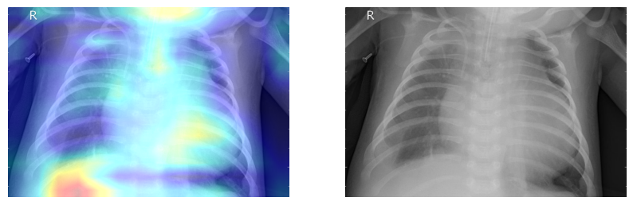

# Pneumonia_Detection

1. [Introduction](#introduction)
2. [Dataset](#dataset)
   * [Kaggle](#kaggle)
   * [Description](#description)
3. [Methods](#methods)
   * [Data Visualization](#data-visualization)
   * [Deep Learning models](#deep-learning-models)
       * [Model from scratch](#model-from-scratch)
       * [Transfer Learning](#transfer-learning)
   * [Grad-Cam](#grad-cam)
4. [Main Results](#main-results)
5. [Docker App](#docker-app)
6. [References](#references)

## Introduction

This project aims to study a public dataset on pneumonia detection based on a binary classification problem. I performed a data visualization phase, created a deep learning model from scratch, compared it with a transfer learning technique and completed this study with a grad cam integration. At the end of this case study, I created a docker app to upload a test function and receive prediction with heatmap from grad-cam.

According to World Health Organization (WHO)[[1](#ref1)], Pneumonia killed more than 808 000 children under the age of 5 in 2017, accounting for 15% of all deaths of children under 5 years. This not a disease only related to children, but it also includes adults over the age of 65 and people with preexisting health problems.

Pneumonia is a form of acute respiratory infection that is most commonly caused by viruses or bacteria.  When an individual has pneumonia, the alveoli are filled with pus and fluid, which makes breathing painful and limits oxygen intake. Timely and accurate diagnosis is crucial for effective treatment and management of pneumonia cases.

Some common methods [[2](#ref2)] used to diagnose pneumonia are:

- Blood tests, including a complete blood count (CBC) 
- Chest X-ray
- CT Scan
- Pulse Oximetry

## Dataset

### Kaggle

Dataset taken from: https://www.kaggle.com/datasets/paultimothymooney/chest-xray-pneumonia

It is composed by three main folders: train, test, val. Each of them contains two folders: NORMAL and PNEUMONIA. There are 5,863 X-Ray images (JPEG) and 2 categories (Pneumonia/Normal).

In [images](images/) there are just few examples to see the images I used. You can find the entire dataset at the Kaggle link.

### Description

Chest X-ray is one of the most commonly used imaging tests to diagnose pneumonia. They are widely available in medical facilities like clinics and hospitals, are generally more cost-effective and non-invasive for the patients. This kind of images can reveal the presence of infiltrates and other abnormalities in the lungs.

The dataset is distributed as shown in the following bar plot:

## Methods

### Data Visualization

In [data visualization notebook](data_visualization.ipynb), I used open cv, matplotlib, seaborn to visualize some useful information about the images and the dataset.

I've applied **Canny's Filter** as edge detector in order to enhance the visibility of edges in the images. It is an edge detection operator that uses a multi-stage algorithm to detect a wide range of edges in images. It was useful for detecting edges in noisy images and is particularly effective due to its ability to suppress noise while preserving important edge information. 

I've analyzed the distribution of widths and heights for images in each class (Pneumonia and Normal). Histogram analysis provides valuable insights so to verify no differences into the distribution of pixel intensities across images.

I've also compared pixel distribution for two representative images from the Pneumonia and Normal classes. This was necessary to see if there were some kind of discrepancies between the two classes.

### Deep Learning models

In [model deep learning notebook](model_deep_learning.ipynb), I wanted to create two different deep learning approaches to detect pneumonia in this binary classification problem: a DL model from scratch and a DL model based on transfer learning technique. 

The main idea was that the transfer learning model would have reached the best performances compared to the first one and it would have verified the enourmous power offered by this technique. I applied the base model taken from a benchmark algorithm, already pre-trained for another purpose (face recognition), and reused for my goal (pneumonia detection).

#### Model from scratch

Before feeding the images into the model, preprocessing is essential to ensure the data is in a suitable format for training. I used ImageDataGenerator from tensorflow.keras.preprocessing.image, which is a class used for real-time data augmentation. Here, it's used to rescale the pixel values of the images to the range [0, 1] by dividing by 255. Target size dimensions are set to (224,224) and batch size is 16 for training set.

The convolutional neural network (CNN) was built from scratch using Keras' Sequential API. The model consists of:

- **Conv2D Layers:** Four convolutional layers with increasing filter sizes (32, 64, 128, 128) to learn spatial hierarchies of features.
- **BatchNormalization:** Applied after each convolutional layer to stabilize and accelerate training.
- **MaxPooling2D:** Applied after each block of Conv2D and BatchNormalization layers to reduce spatial dimensions and extract dominant features.
- **Flatten:** Flattens the 3D output to 1D to feed into the fully connected layers.
- **Dense Layers:** Two fully connected layers. The first Dense layer has 512 units with ReLU activation followed by Dropout for regularization, and the second Dense layer has 1 unit with sigmoid activation for binary classification.

The model was compiled with the Adam optimizer, binary cross-entropy loss, and accuracy as the evaluation metric. Due to the imbalance in the dataset, class weights were computed to give higher importance to the minority class during training (0.74 for label 0, 0.26 for label 1). The model was trained using GPU acceleration (if available) to speed up the training process.

#### Transfer Learning

Transfer learning leverages pre-trained models, which have been trained on large datasets for different tasks, to solve new but related tasks. Among the advantages:
1. Training time reduced 
2. Performance improved
3. Less data required

I used a pre-trained VGG-Face model [[3](#ref3)]  to classify chest X-ray images for pneumonia detection. Although the VGG-Face model was originally trained for face recognition, its learned features are general enough to be useful for other types of image classification tasks. By freezing the pre-trained layers and adding custom layers, the model can focus on learning task-specific features without overfitting, leading to more accurate and efficient classification.

The VGG-Face model is loaded from the python library DeepFace [[4](#ref4)]. This model, pre-trained on a large dataset for face recognition, serves as the base model. All layers of the VGG-Face model are frozen. This means their weights will not be updated during training, preserving the valuable features they have learned.

A series of custom layers are added on top of the pre-trained model to adapt it to our specific task (pneumonia detection):
- **Flatten Layer:** Flattens the output of the last convolutional layer of the VGG-Face model.
- **Dense Layer:** Adds a fully connected layer with 512 units and ReLU activation.
- **Dropout Layer:** Adds a dropout layer with a dropout rate of 0.5 to prevent overfitting.
- **Output Layer:** Adds a dense layer with 1 unit and sigmoid activation for binary classification (Pneumonia or Normal).

The model is compiled using the Adam optimizer, binary cross-entropy loss, and accuracy as the evaluation metric. Also for this approach, I used class weights to handle class imbalance.

### Grad-Cam

In [grad cam notebook](grad_cam.ipynb), I implemented a Grad-CAM (Gradient-weighted Class Activation Mapping) technique used to visualize the regions of an image that are most important for a neural network’s decision. It highlights the areas in the input image that are most relevant to the prediction made by the model, providing insights into which parts of an X-ray are contributing to a diagnosis.

Grad-CAM works by leveraging the gradients of the target class, flowing into the final convolutional layer of a CNN. The gradients are averaged over all the pixels to obtain the weights. It generates a localization map, highlighting the important regions in the image. These are heatmaps, normalized and visualized to highlight the important regions in the input image.

The function make_gradcam_heatmap in the [py file](fucntions_for_grad_cam.py) takes an input image array, computes the gradient of the predicted class score with respect to the activations of the last convolutional layer, and generates a Grad-CAM heatmap which tells me how much each activation in that layer influences the predicted class score. The grad_model is created by using the tf.keras.models.Model API. I used tf.GradientTape() to compute the gradients.

## Main Results

The primary objective of this project was to compare the performance of a deep learning model built from scratch with a transfer learning model for pneumonia detection. The transfer learning approach was anticipated to perform better due to leveraging pre-trained weights from a model trained on a large dataset. For this reason, I want to verify this thesis and below are the results for both models, including the accuracy and loss for the training and validation sets:

| Model                | Training Accuracy (mean ± std) | Training Loss (mean ± std) | Validation Accuracy (mean ± std) | Validation Loss (mean ± std) |
|----------------------|---------------------------------|-----------------------------|-----------------------------------|-------------------------------|
| Model from Scratch   | 0.95 ± 0.02                     | 0.90 ± 0.24                 | 0.65 ± 0.17                       | 51.77 ± 49.32                   |
| Transfer Learning    | 0.94 ± 0.02                     | 0.06 ± 0.02                 | 0.77 ± 0.06                       | 0.47 ± 0.09                   |

The transfer learning model outperformed the model built from scratch, demonstrating higher accuracy and lower loss on both the training and validation sets. This confirms the advantage of using pre-trained models in medical imaging tasks, where obtaining a large labeled dataset is often challenging.

The table below presents the detailed classification report for the transfer learning model:

| Metric             | 0 (Normal) | 1 (Pneumonia) | Accuracy | Macro Avg | Weighted Avg |
|--------------------|------------|---------------|----------|-----------|--------------|
| Precision          | 0.812749   | 0.919571      | 0.876603 | 0.866160  | 0.879513     |
| Recall             | 0.871795   | 0.879487      | 0.876603 | 0.875641  | 0.876603     |
| F1-Score           | 0.841237   | 0.899083      | 0.876603 | 0.870160  | 0.877391     |
| Support            | 234        | 390           | 0.876603 | 624       | 624          |

The transfer learning model achieved high precision, recall, and F1-scores for both classes, indicating its robustness and reliability in detecting pneumonia from chest X-ray images.

Transfer learning reached a better performance in terms of accuracy also evaluating the test dataset: 0.88, respect to the 0.82 reached by the scratch model.

By integrating Grad-CAM, we were able to not only achieve high performance in pneumonia detection but also improve the transparency and explainability of our model, which is a significant step towards the practical deployment of AI in healthcare. Here an example:

## Docker App

Details about the Docker app created for deploying the project, including how to run it locally and any dependencies.

docker build -t pneumonia-gradcam-app .                             

docker run --platform linux/amd64 -p 5001:5000 pneumonia-gradcam-app

## References

1.  https://www.who.int/health-topics/pneumonia#tab=tab_1
2.  https://www.nhlbi.nih.gov/health/pneumonia/diagnosis#:~:text=A%20chest%20X%2Dray%20is,enough%20oxygen%20into%20your%20blood.
3.   Parkhi, Omkar, Andrea Vedaldi, and Andrew Zisserman. "Deep face recognition." BMVC 2015-Proceedings of the British Machine Vision Conference 2015. British Machine Vision Association, 2015.
4.  https://github.com/serengil/deepface